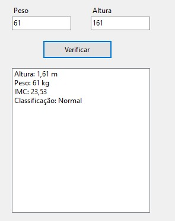
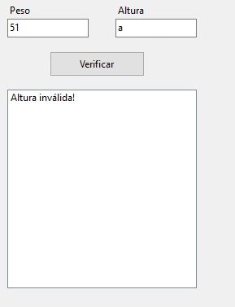
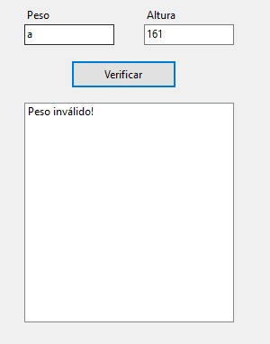
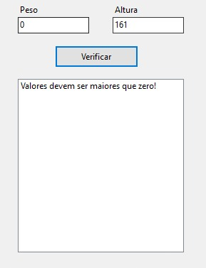

# Calculadora de IMC (C# .NET)

Este projeto foi desenvolvido para aplicar conceitos de lógica de programação e validação de dados em ambiente Windows Forms. O sistema calcula o Índice de Massa Corporal e fornece a classificação de saúde baseada nos padrões da OMS.

## Tecnologias
- C# .NET
- Windows Forms

## Funcionalidades
- Entrada de dados com validação (evita erros de digitação e campos vazios)
- Lógica de tratamento para entradas em CM ou metros
- Exibição de resultados formatados em uma lista de fácil leitura

## Demonstração

### Funcionamento

### Validação de dados

